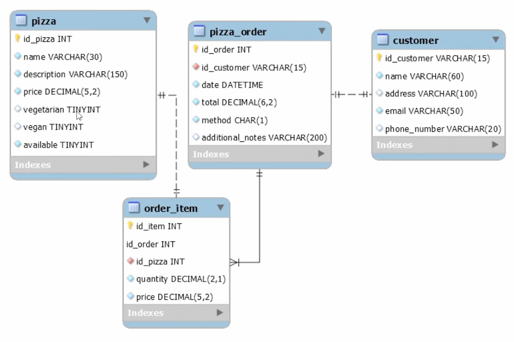
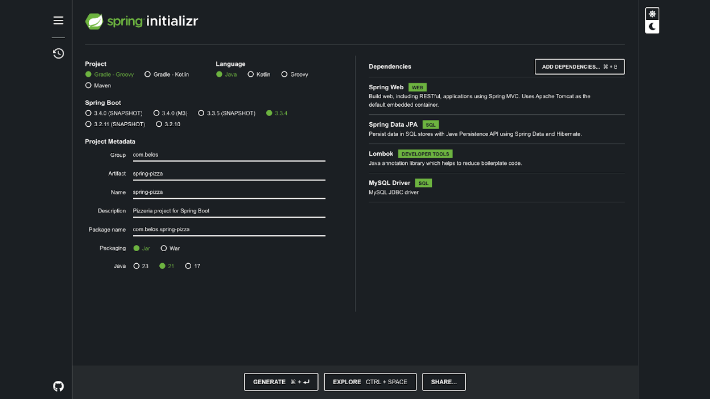

# SPRING DATA JPA

* [Drive](https://drive.google.com/drive/u/2/folders/1fI-a1iHDykf1mxImRk2gq3sYNu6Qp4cM)
* [Captura Apuntes](https://docs.google.com/document/d/1AUU2yWlbI9tvZ-sUAyw5rv9EtTVBJmAIe9HsoNVh8qM/edit?tab=t.0)

## MER Proyecto



### Initializr



## Conexión Mysql desde terminal

```shell
mysql -u root -p
```

## Conexión SpringBoot a Mysql

application.properties

```properties
spring.application.name=spring-pizza
spring.datasource.driver-class-name=com.mysql.cj.jdbc.Driver
spring.datasource.url=jdbc:mysql://localhost:3306/pizzeria?createDatabaseIfNotExist=true
spring.datasource.username=root
spring.datasource.password=12345678
#para actualizar el esquema automaticamente si cambian los entities
spring.jpa.hibernate.ddl-auto=update
spring.jpa.show-sql=true
```

### Conexión SpringBoot a Posgres

application.properties

```properties
spring.datasource.driver-class-name=org.postgresql.Driver
spring.datasource.url=jdbc:postgresql://localhost:5432:<NombreDeBaseDeDatos>
```

build.gradle

```gradle
runtimeOnly 'org.postgresql:postgresql'
```

### application.yaml con postgresql

borrar application.properties y poner application.yaml

```yaml
spring:
  datasource:
    url: jdbc:postgresql://localhost:5432/pizza
    username: admin
    password: Jaime2030
  jpa:
    hibernate:
      ddl-auto: update
      dialect: org.hibernate.dialect.PostgreSQLDialect
      jdbc:
        lob.non-contextual-creation: true
    properties:
      hibernate:
        show_sql: true 
```

## Lombok

### @Getter @Setter

lo que hacen es generar automáticamente los getters y setters de cada una de las propiedades, esto ayuda a que el código
sea más legible y no que apenas abres la clase, ves el chorrero de getters y setters, otra ventaja es que si a la clase
le añades una propiedad pero olvidaste añadir el get y set, Lombok usando estas anotaciones lo hace automáticamente por
ti.
<br>
no se recomienda @Data ya que lombok gestiona automáticamente los métodos equals() y hasCode() lo cual es una mala
practica hacerlo a través de lombok para entidades

en su lugar se coloca @Getter @Setter @NoArgsConstructor

## JdbcTemplate

* se inyecta en el constructor de un servicio usando @Autowired
* Actua como una capa de abstracción sobre api jdbc

## Spring Repository

* JPA REPOSITORY Extiende de CrudRepository y PagingAndSortingRepository
* Tiene operaciones de JPA como FLUSH y tareas especificas de DB
* usar el tag `@EnableJpaRepositories` en la clase principal
* CrudRepository retorna un Iterable<T> que es un set
* ListCrudRepository retorna un List<T>
* Los Spring Repository ayudan a interactuar con la DB con poco codigo

## LAZY & EAGER

* **FetchType.LAZY:** No carga la relación sino hasta que se use, si no se usa la relac. no se carga nada
* **FetchType.EAGER:** Cuando se recupere una entidad se recupere automaticamente la relación

#### Valores por defecto


> Sólo usar relaciones estrictamente necesarias para el código y usar el FetchType.LAZY para mejorar el rendimiento

* OneToMany: LAZY
* ManyToOne: EAGER
* ManyToMany: LAZY
* OneToOne: EAGER

## Query Methods

* Convierten los queryMethod a sql en tiempo de ejecución
* Orden QueryMethod en Pizza: Repository->Service->Controller
* Siempre el uso de los QueryMethods son de mayor utilidad a la hora de personalizar nuestras consultas hacia la base de
  datos, y la utilidad de poder retornar una sublista de una lista de objetos como lo es **Page ** nos da la posibilidad
  de paginar las respuestas y adicional agregar una dirección de ordenamiento ascendente o descendente

### Sinónimos queryMethod findAllBy()

* getAllBy()
* queryBy()
* searchAllBy()

## Actualización queryMethod en PizzaRepostitory

Se reemplazó

```java
PizzaEntity findAllByAvailableTrueAndNameIgnoreCase(String name);
```

por

```java
Optional<PizzaEntity> findFirstByAvailableTrueAndNameIgnoreCase(String name);
```

También se puede usar findByTop

## ListPagingAndSortingRepository<PizzaEntity, Integer>

* crear interface PizzaPagSortReposotory que extiende de esta gran interface
* Provee de Paginación y Sorting de consultas
* Siempre hay que reemplazar los tipos de return List por Page
* Hay que utilizar interfaces de Spring Data como Pageable, PageRequest, Sort

### Pageable

Interface de Spring Data para implementar paginación en consultas

## JPQL

* Java Persistence Query Language
* Permite hacer consultas a la DB basadas en las entities, en lugar del sql tracicional que usa tablas y columnas
* Hibernate convierte el jpql en sql nativo
* Se definen en el Repositorio y son una alternativa a los queryMethods
* usan el tag @Query
* el nombre de la variable `:phone` coincide con el nombre `@Param("phone")`
```java
@Query(value = "select c from CustomerEntity c where c.phoneNumber = :phone")
CustomerEntity findByPhone(@Param("phone") String phone);
```

## Query Nativo
* Similar al jpql sólo que hay que ponerle el atributo `nativeQuery = true` en el tag @Query
* se puede implementar un @OrderBy en un atributo de la entidad
```java
@OneToMany(mappedBy = "order")
@OrderBy("price desc")
private List<OrderItemEntity> items;
```